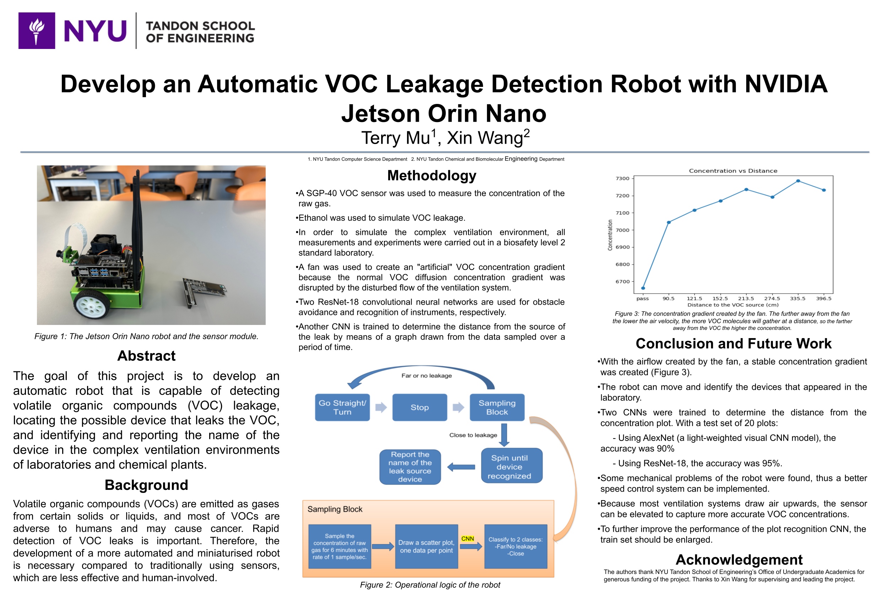

# UGSRP-SCENT_VIP
This is the legacy repo of the UGSRP/VIP of Smart Chemical Emission Navigation Tracker. To learn more, read the poster below :) 

--------------------------------------------------------------------------------------------------------------------------------------------

## Current Experiment
**Experiment 1: CNN**
- Problem: no matter on what distance, because of the turbulence, the plot of concentration changes a little.
- Observations: When the distance is large (~300 cm for experiment purposes), there are rarely large changes in concentration.
                When the distance is small (~90 cm for experiment purposes), for some time point, the concentration changes frequentely and drastically.
- Method: CNN can be used to estimate the distance (classification, with 2 classes for experiment purposes) from the difference in the length of the period where the concentration changes.
  Alexnet and ResNet-18 were tested.
- Result: ResNet-18 has higher accuracy.

**Experiment 2: filter**
- The concentration-changing part can be considered as high-frequency components of the concentration signal.
- In time domain, the larger distance -> fewer high-freq components; vice versa for little distance.
- High-pass filter can be used to amplify the difference

  **TO DO (If continue with legacy settings)**: train model based on high-pass-filtered data and compare the accuracy.

